# The Daily Green News Site
### Developer: Edward Gurney

### You can view the live project here: [The Daily Green](https://the-daily-green.herokuapp.com/)
 

## **Table of Contents**

## **Project 4 - Introduction**

This website is a news-site for renewable energy news articles, focussing on the two most deployable technologies for mainstream implementation in the domestic built environment, Solar P.V. and Air Source Heat Pumps. 

The site has been designed to allow users to get all of the latest news on these specific technologies from new government legislation and installation rates to opinion pieces from journalists and case studies. Additionally, it is a place for like-minded people to be able to discuss current topics and trends, leaving comments on articles and also voting and downvoting articles. To facilitate this user experience CRUD functionality is employed using a database to store relevant data.

For full functionality users need to register and log in to be able to comment and vote on articles. 

An Agile methodolgy was used during the development process and this has been documented through the use of the projects tab in github reocrding issues and utlisation of kanban boards.

 

## **User Experience**

### *Project Goals*

- The Daily Green News Site is a place for users to receive the latest news on mainstream renewable energy technologies, and to be part of a community of like minded people that can engage with the articles and each other.

### *Site Owner Goals* 

- The goal of the site is to keep users up to date on the latest news concerning Solar P.V. and Air Source Heat Pumps.
- For users to return and keep up to date on news and to register and actively engage with a growing community.
- For the users to enjoy it enough to recommend it to colleagues who they feel would also be interested. 
- To create a database of user details and e-mail addresses that can be used to contact them indivdually if required.
- Produce an initial site that is scaleable, with opportunities to develop and improve through version releases, that could become commercialised through various means, including contacting users via e-mail about potentially intersting products.
- To make the site as easy as possible to navigate to encourage users to return, including a search functionality to return to articles and conversation threads. 
- To encourage a positive community where offensive behaviour is not tolerated and thus, the ability to remove comments and delete users.
- To be able to build relationships with the most frequesnt users.
- I would like to be able to add new articles and amend existing ones.

### *First Time User Goals* 

- I want to be able to access current news to stay up to date on the latest industry developments and stories. 
- I want it to be easy to use, where stories can be accessed quickly.
- I want to be able to comment on articles and engage with like minded people.
- I want to be able to search articles with certain keywords.
- I want to be part of a community that is constructive and positive.
- I want to be able to register on the site and be able to log in.
- I want to be able to see what articles fellow users recommend reading.
- I want to be able to see the latest stroies first.
- I want to be able to scroll through pages to read all headlines to identify stories that may be interest to me.

### *Returning User Goals*

- I want the stories to be easily findable, so that I can continue reading an article if I am stopped during reading it.
- I want to be able to find the articles easily via a search bar so that I can find articles I have commented on previously, add more comments and see if anyone has added to the debate/conversation. 
- I want only registered users to be able to leave comments to encourage a positive community and motivate me to return.

### *Repeat User Goals*

- I want to be able to continue the conversation by being able to find the articles I have commented on easily.
- I want to be able to flag offensive posts for admin to address so that the community remains a positive place to be. 

## **Design**

### *Drawn Wireframe*

  The initial design I used with a pen and paper when getting my initial thoughts down on paper.

  

 

### *Balsamiq Wireframes*

  A Balsamiq wireframe of the homepage 
  
 

 

  A Balsamiq wireframe of an article page once the article headline has been clicked on 
  
 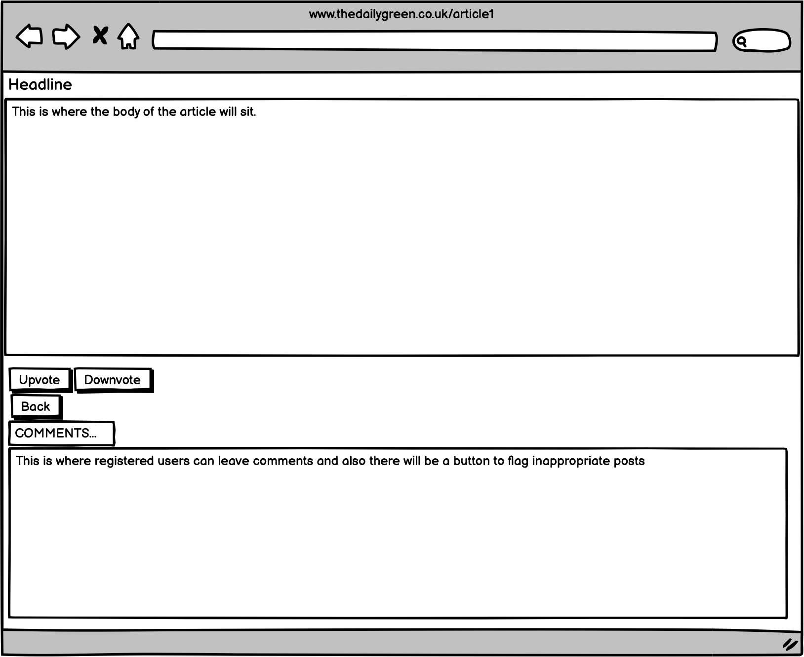

 

  This dropdown shows a Balsamiq wireframe of the homepage represented on a mobile phone 
  
 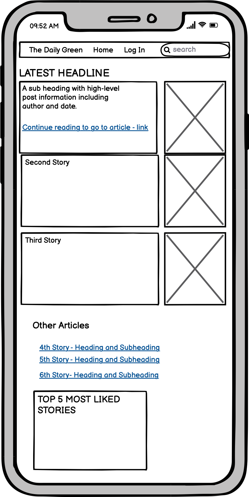

 

## **Technology Used**

### *Languages*
- HTML, CSS, Javascript (via Bootstrap), Python 3, Django

### *Frameworks and Programmes*
- Github - has been used to store the code.
- Gitpod - was used as version control to commit and push to Github and Heroku.
- Heroku - was used to deploy the site.
- Bootstrap - was used for the design and responsiveness. 
- Balsamiq - was used to develop the initial wireframe drawings further.

### *Database Framework*
- Postgres - was used to implement the data model.

### *Imports*
The following were imported from various sources including Django views, shortcuts, urls and http.

- render, ListView, DetailView, count, reverse, login_required, HttpResponse, HttpResponseRedirec, get_object_or_404

## **Features**

### **Existing Features**

- Below are descriptions of features with screenshots that demonstrate the project outcomes and website layout, click on the drop down arrow to view image examples.

#### **Homepage**

  This is the homepage during project development before articles were uploaded. If you are not signed in you are still able to access the homepage and read articles
  
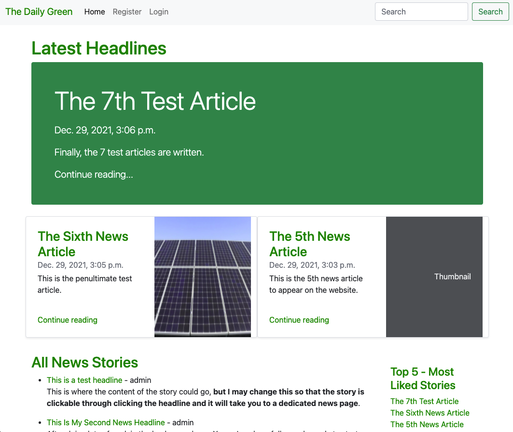

 

  This is a screenshot of the top of the homepage once completed
  
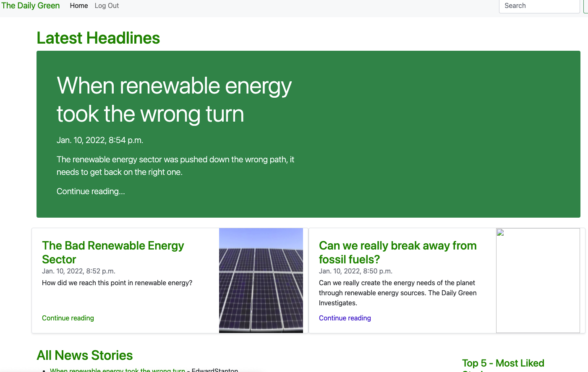

 

#### **Navigation Bar**

  On every page (forms base.html) is a fully responsive navigation bar where links vary depending on logged in status. 
  
  
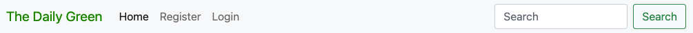

- If the user is not logged in then a "Login" link is displayed, (see dropdown arrow for picture).
- If the user is logged in then a "logout" link is displayed (see below).
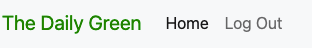
 

#### **Log in page**

  Users can enter their usernames and passwords. When site users aren't logged in and try to leave a comment or like/dislike an article, they are sent to the login page, which also has a link to sign up
  
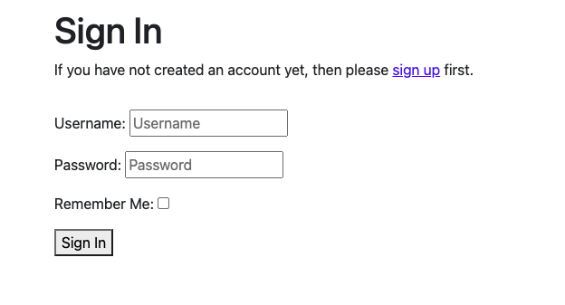

 

#### **Sign out page**

  When users are signing out it asks users for confirmation
  
  
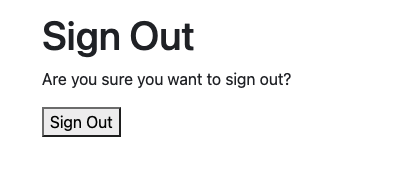

 

#### **Sign up page**

  When clicking the sign-up page users are sent here.
  
  
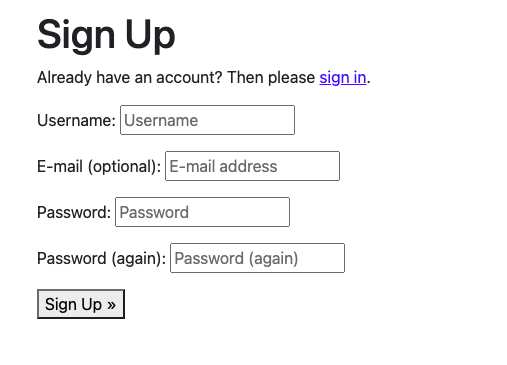

 

#### **Search Results Page**

  When users search using keywords, the headlines of all articles on the site are searched and any matches returned.
  
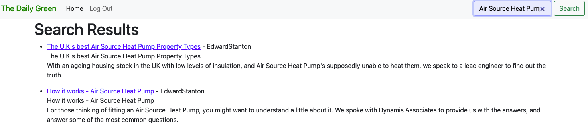

 

#### **Article Details Page**

  Clicking the article headline takes the user through to the article page where they can interact with the content
  
  
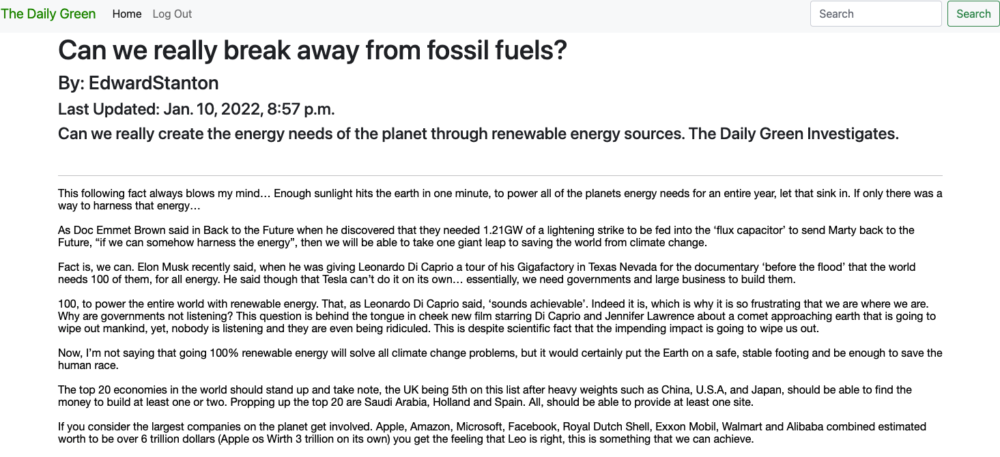

 

#### **Up/Down-vote and comments section**

  At the bottom of the article users are able to up and downvote the article. This is then stored in the model so admin can see from admin and also the number of likes is used to formulate the popular stories table on the homepage. Users can also leave their comments in this area of the article detail page
  

 

#### **Comments section with button to flag inappropriate posts**

  Users can leave comments and engage with the community, they can also notify site admin of any imappropriate posts by clicking the face icon.
  
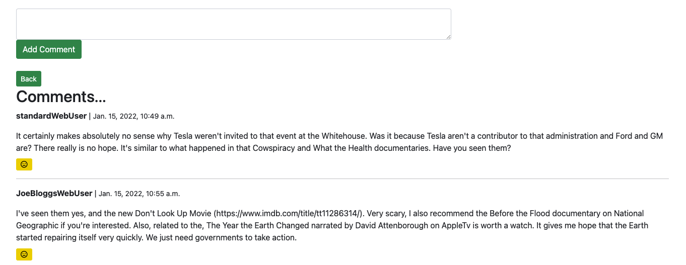

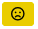
 

### **Top 5 articles section**

This is where users can see the. most liked articles on the site
  
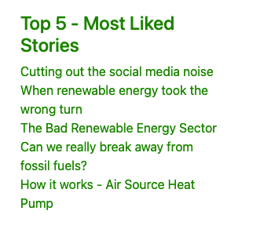

 

#### **DJANGO ADMIN AREA**
- Site admin can access the admin area to edit models if required. Additionally site admin can add articles here that will appear on the site.
- Admin can see an inappropriate posts counter in the comments sectin of the admin area. This shows where users have clicked an inappropriate post so that site admin can review and remove if required.
- Site admin can view registered users, site activity and filter posts on comments through various waye, e.g through date posted or by author. 

Filter in admin panel
  
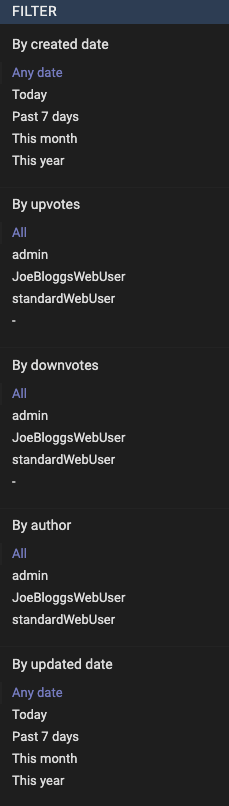

Inappropriate Post Counter in admin

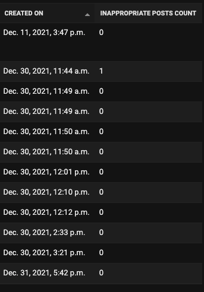

 

## **Database Schema**
- The user admin model from Django was utilised with the following models 

  
  Entity Relationship Diagram - POSTS Model
  
  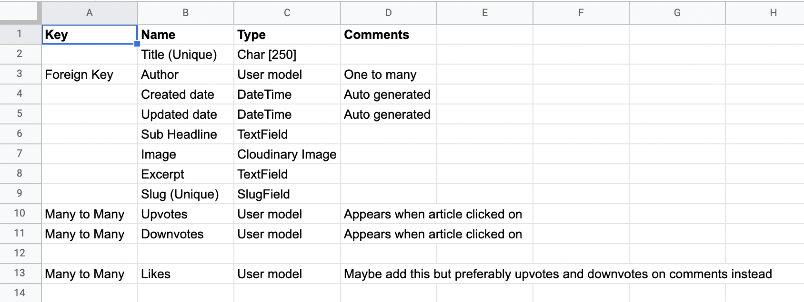

  Entity Relationship Diagram - COMMENTS Model
   
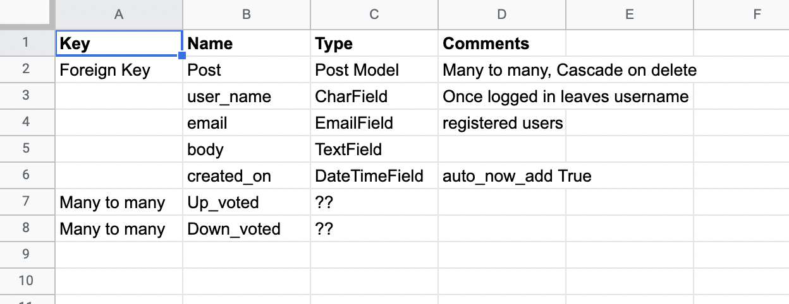

 

### **Features to Implement in future Versions**
- When a user clicks the inappropriate post button for a notifcation to tell them that the site admin will review the post shortly and remove. 

- If the users downvote an article, it deducts it from the upvote count for the most popular articles table on the righthandisde of the home page.

- Currently, clicking 'Add Comment' when the user hasn't added a comment leaves a blank comment in the comments section. this should be changed so that a user cannot post unless they have entered text.

## **Testing**

## **Languages Used & Validation** - Python.
### **PEP8 Validation**
PEP8 online validation was used to check for any errors. All of the code passes with no errors or warning present due to bad code.  Example screen shots of some of the code are below:

  This screen shows the top of the file and the code being accepted on Pep8 for Python code. All python code was tested using this process. The three errors that remain are due to a long variable name and breaking these down into a line underneath would not have solved the problem. Additionally, for example purposes I made the changes elsewhere in the models.py file and moved any lines that were too long to the line below. However, whilst I am aware of the 'line too long' item, it applies to a time when monitors were smaller and a max line limit of 80 was the accepted convention. Nowadays with bigger screens this is no longer the case, and longer lines are still readable. Therefore going forward, I have no issue with my lines being longer becasue I believe it makes it easier to read than breaking it down onto individual lines. Of course, if the line is excessively long then I will break it down, but only if I believe it becomes unreadable.
  
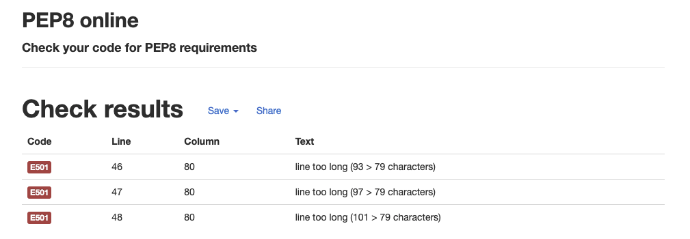

 

### **WC3 Validation**
The WC3 validator was used to check for any errors in the HTML code. All code passes with no errors.

 

### **CSS Validation**

  The WC3 CSS validator was used to check for any errors in the CSS code. All code passes with no errors.

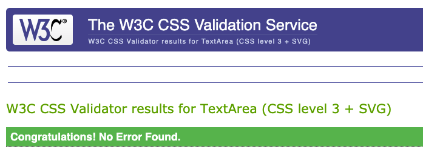

## **Manual Testing**
- The site has been used by friends and family to try and find any errors. There are no known errors in this version that have been found that haven't been fixed during the development process.
- Throughout the process the developer has navigated through the site on a continual basis for over a month and no issues are currently noted.
- Google Chrome Developer tools has been used throughout to identify styling issues that impact upon display and UX. Dveloper tools was used to find the errors and amend. 
- During the project Agile methodology was employed to encourage efficient project development. Kanban boards were used as part of this process and each issuse was fully tested before moving to 'complete'.
- All links were tested multiple times during the development process and after deployment. 
 

### **Compatability Testing**

- The site was tested on a number of browsers including Chrome, Safari and Edge. No bugs were found. 
- The site was tested on a number of devices including - Iphone XR, Iphone SE12 and an Ipad. 
- The site was also tested on the [am I responsive site](http://ami.responsivedesign.is/).

## **Bugs**

### Fixed Bugs
### Bug/Issue

- When trying to add a new field into a model already migrated the error message was:

“You are trying to add a non-nullable field 'content' to post without a default; we can't do that (the database needs something to populate existing rows).
Please select a fix:
 1) Provide a one-off default now (will be set on all existing rows with a null value for this column)
 2) Quit, and let me add a default in models.py
Select an option: 2”

I solved this by researching stack overflow and this pytutorial site:

https://pytutorial.com/how-to-solve-you-are-trying-to-add-a-non-nullable-field-to-without-a-default

- HomeView was showing unwanted code when rendering to the site, for example p tags were being rendered, this shouldn’t have been happening. Also b tags were showing up for bold text and &nbsp was also being rendered. This would have impacted upon UX. See picture below:

This was solved by adding |safe when there was HTML where it appears. e.g. {{ post.content|safe }}.

I found this resolution in the django documents: https://docs.djangoproject.com/en/4.0/ref/templates/builtins/#std:templatefilter-safe

- The search bar wasn’t working properly because it didn’t recognise case sensitive user input. This meant that users adding something with capitals at the start it would not search properly. Adding an I before contains (icontains) stopped this problem from occurring because it is case insensitive.  
This was found in the search function django documentation:
https://docs.djangoproject.com/en/4.0/topics/db/search/

- Pagination was not working properly, Pagination was set to 6 in my HomeView class, but articles were disappearing off the page once they were past 6 and were not locatable. I googled how to paginate with google and found the following article: 
https://simpleisbetterthancomplex.com/tutorial/2016/08/03/how-to-paginate-with-django.html
 I used some of the code here as a basis to fix the problem (which you can see is in my code), but had to make changes to suit the site, for example adding in classes and. I also added in some bootstrap code to make it more aesthetically pleasing. 

- The most liked chart wasn’t working. The reason for this I discovered is becasue my model as a many to many wasn’t an integer so it was posting articles that had been liked but not in any coherent order. Django documentation used was:  
https://docs.djangoproject.com/en/4.0/topics/db/aggregation/ 
I used annotate to create an (temporary) upvotes counter and then was able to order it in descending order of the created upvotes count with order_by.

 

### Unfixed Bugs ans issues

- When a user clicks 'submit comment' without entering any text, a blank comment is left in the 
comments section. This issue (it is not a bug) is to be ammended in a future version, where the 
user has to enter text in the comment box to be able to submit comment. 

- After significant testing there does not seem to be any bugs at present. 

## **Deployment**

The app was deployed on Heroku in the following steps:

1. Created a Heroku account (or log in if existing user).
2. In the upper right hand corner clicked "New" and then selected "Create New App".
3. Chose a name for the app and region and clicked "Create App".
4. Click on settings tab and then select "Reveal config vars".
5. Add required config variables including postgres database url.
4. On the settings tab, ensure heroku/python build pack is selected.
5. Picked Github as the deployment method on the "deploy" tab.
6. Search for repository 
7. Enable automatic deploys and then deploy branch
8. Once processing has finished click on "View"

### Database

1. Add DATABASE_URL to settings.py:
    DATABASES = {
    'default': dj_database_url.parse(os.environ.get('your database url'))}
2. Migrate database (after perfroming --dry-run)
3. Create superuser to navigate database

 
To clone this repository follow the below steps:

1. Go to the GitHub repository
2. Click on the Coode drop down button and select if you wish to clone with either HTTPS, SSH or Ghib CLI.
3. Click the copy button (clipboard emblem).
4. Open Git Bash (Mac or Windows)
5. Choose the working directory
6. Type git clone to add the copied URL.
7. Press Enter. (This will create your clone).

## **Credits**

- The code used to fix the pagination issues previously mentioned in the bugs/issues section was taken from a website called [simpleisbetterthancomplex.com](https://simpleisbetterthancomplex.com/tutorial/2016/08/03/how-to-paginate-with-django.html)

-Codemy youtube channel and series videos on how to use a [blog](https://www.youtube.com/playlist?list=PLCC34OHNcOtr025c1kHSPrnP18YPB-NFi) was used alongside the Code Institute tutorials for project set up and clarity on django.

- Bootstrap was used for the design of the site, using for example headers and buttons and implementing them to the site. A [Bootstrap](https://getbootstrap.com/docs/4.3/examples/blog/) template was used for inspiration and as a basis for the newsite. 

- Images for the site were taken from a free images site [pexels](https://www.pexels.com/search/solar/) and were provided from a further site uploaded to pexels called [pixabay](https://www.pexels.com/@pixabay)

- Content for the site was written by the developer as part of his role in the renewable energy industry [diagrams.net](https://www.diagrams.net/)

- Some additional content was added to the site for demonstration of site functionality only and all content was taken from [site]()

## **Acknowledgements**

- My mentor Chris Quin for his continued support in my projects despite being away when I had my first session on this project. Additionally his help in giving me a confidence boost without even knowing he's doing it.
- My heavily pregnant wife Rebecca for her continued support during many hours working through this course and looking after our daughter whilst I stress out and try and code.

